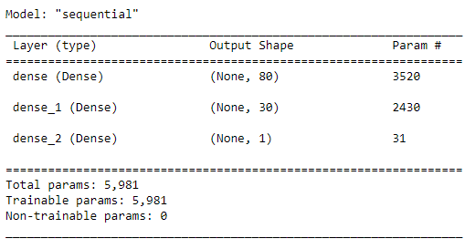
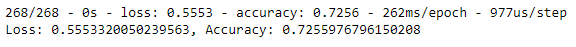
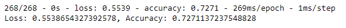
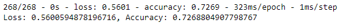
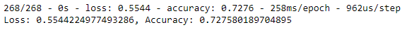

# Neural Network Charity Analysis

## Overview of Analysis

### Purpose

Alphabet Soup, a nonprofit foundation that helps other organizations by raising and donating money, wants to make sure their money is being used effectively. They would like to predict which organizations should receive donations and which are too high risk with a deep learning neural network. I will be using TensorFlow to create a deep learning binary classification model that can predict whether applicants will be successful if funded.  

## Results

### Data Preprocessing

The dataset of previous organizations that have received funding from Alphabet Soup needs to be preprocessed by binning categorical variables with more than 10 unique values, encoding categorical variables with `OneHotEncoder` and standardizing numerical variables with `StandardScaler`.

- The target variable is IS_SUCCESSFUL since that is the outcome we're trying to predict.
- The feature variables are APPLICATION_TYPE, AFFILIATION, CLASSIFICATION, USE_CASE, ORGANIZATION, STATUS, INCOME_AMT, SPECIAL_CONSIDERATIONS, and ASK_AMT. 
- The variables that should be removed from the input data are EIN and NAME because these are identification only columns that are not beneficial. 

### Compiling, Training, and Evaluating the Model

#### Model Structure

- Two hidden layers were selected since a basic neural network with only one hidden layer would struggle to interpret our complex nonlinear data. 
- There are 80 neurons in the first hidden layer and 30 neurons in the second, which is less than the suggested two to three times the number of input variables for a basic neural network in order to avoid overfitting the data. 
- The `relu` activation function was selected for the hidden layers to identify nonlinear characteristics while the `sigmoid` activation function was selected for the output layer because we are trying to predict the probability of success.

#### Model Performance

As seen in the image above, the model was able to correctly predict an organization's success 72.6% of the time. This is below the target model performance of 75%.

#### Model Optimization

Since the original model did not achieve the target performance, I took several steps to try to increase performance.

- **Optimization1**: I adjusted the input data by dropping the ASK_AMT column since it was a noisy variable with many outliers that may have been causing confusion in the model. The performance only slightly increased to 72.7%. 
  - 
- **Optimization2**: I added more neurons to the hidden layers and an additional hidden layer. The performance remained the same at 72.7%.
  - 
- **Optimization3**: I changed the activation function of one of the hidden layers to `tanh` and reduced the number of epochs to 50 to try to avoid overfitting. The performance only slightly increased to 72.8%. 
  - 

## Summary

Even after attempting to optimize my model several times, I was unable to achieve a target predictive accuracy higher than 75%. The changes I made minimally increased model performance, if at all, and I was not able to get above 73% accuracy. 

### Recommendation

Instead of a deep learning model, I would recommend a support vector machine (SVM) to solve this classification problem. SVMs excel at classifying two groups and can handle nonlinear data. Since we have a binary classification problem, an SVM might be a better model because it is less prone to overfitting and does not focus on a specific trend in the data like a deep learning model. 
